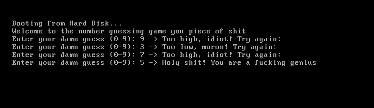

# A shitty number guessing game

> This simple game currently uses a hardcoded value for guessing. currently looking for a way to generate random numbers.

### Run the Code
1. Generates a 512 byte long binary
```bash
nasm -f bin ./game.asm
```

2. Qemu
here we are specifying our binary as a hard disk
```bash
qemu-system-x86_64 -hda ./game
```

### Example Output

